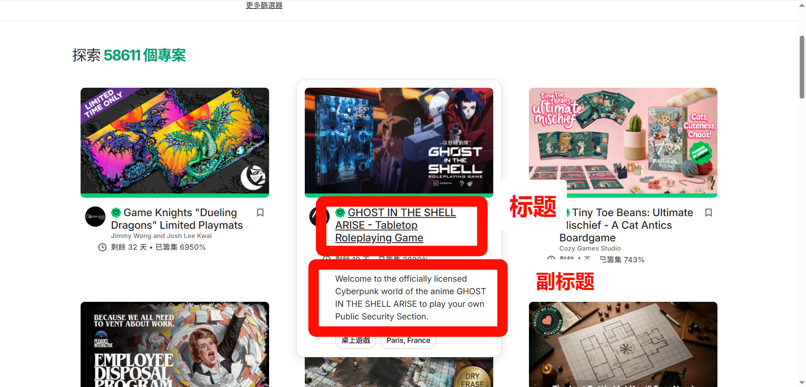

## 需要整理的字段

## 条件判断

1. 需要爬筹集进度大于等于 500% 的项目

## url 示例

1. https://www.kickstarter.com/discover/advanced?category_id=270&sort=magic&seed=2939050&page=3
2. https://www.kickstarter.com/discover/advanced?category_id=271&sort=most_funded&seed=2939051&page=7

## 分类

| 分类 ID | 分类名称     |
| ------- | ------------ |
| 270     | 遊戲相關硬體 |
| 271     | 實況游戲     |
| 272     | 手機游戲     |
| 273     | 撲克牌       |
| 274     | 拼圖         |
| 275     | 桌上游戲     |
| 276     | 電玩         |

## 思路

1. 先按照分类爬一下游戏类目的所有首页
2. 收集所有项目的 url，并且去掉后面的查询参数
3. 分离标题数据，整合进入 Excel
4. 爬取每个项目的详细信息，包括包括详情页与回报页
